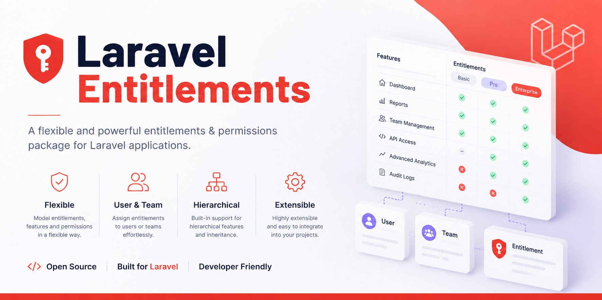

# Laravel Entitlements

[](https://packagist.org/packages/masterix21/laravel-entitlements)
[](https://github.com/masterix21/laravel-entitlements/actions/workflows/run-tests.yml)
[](https://packagist.org/packages/masterix21/laravel-entitlements)
[](LICENSE.md)
[](https://github.com/sponsors/masterix21)

> If this package saves you time, please consider [**sponsoring my work on GitHub**](https://github.com/sponsors/masterix21/) — it directly funds maintenance and new features.

A flexible entitlement management system for Laravel applications. Define subscription plans, issue licenses to any model, and track consumption — slot-based or pool-based — with project-specific entitlement types injected via configuration.

## Why

Every SaaS reinvents the same wheel: plans, plan items, licenses with start/end dates, usage tracking with two-phase release for some resources (a device that must confirm deactivation) and metered drain for others (a token pool). This package extracts that machinery so each project only declares the things that actually change: which entitlement types exist and how each one is consumed.

## Features

- **Polymorphic ownership** — any model with the `HasEntitlements` trait can hold licenses (workspace, team, user, tenant)
- **Plans catalog** — categorized plans with billing period (monthly/yearly), recurring or fixed-term, with translatable names
- **Plan items** — define how many slots of each type a plan grants; flexible items accept per-assignment overrides
- **Four entitlement strategies out of the box**:
  - `SlotStrategy` — one usage per subject, with optional two-phase release (`Active → Releasing → Released`)
  - `PoolStrategy` — drainable counter across multiple licenses, FIFO by expiration
  - `ComputedStrategy` — reads current usage from your application's own domain data
  - `BooleanStrategy` — exposes an on/off feature flag without consumption
- **Project-specific type enum** — declare your own backed enum (e.g. `Device`, `AiTokens`, `Seat`, `ApiCall`) and map each case to a strategy
- **Domain events** — `PlanAssigned`, `LicenseConsumed`, `ReleaseRequested`, `LicenseReleased`, `LicenseReconciled`
- **Reconciliation** — recompute `slot_used` from actual open usages, useful after manual intervention or drift
- **Optional Filament v5 admin UI** — plug-in for Plans/Plan Categories management and a `LicensesRelationManager` for the subscriber resource

## Requirements

- PHP `^8.2`
- Laravel `^11 || ^12 || ^13`
- `spatie/laravel-package-tools`
- `spatie/laravel-translatable` (for translatable plan names)

## Installation

```bash
composer require masterix21/laravel-entitlements
```

Publish the config and migrations:

```bash
php artisan vendor:publish --tag="entitlements-config"
php artisan vendor:publish --tag="entitlements-migrations"
php artisan migrate
```

## Configuration

`config/entitlements.php` after publishing:

```php
return [
    // Required: the backed enum that implements EntitlementType
    'type_enum' => \App\Enums\LicenseType::class,

    // Override models if you want to extend them
    'models' => [
        'plan_category'  => \LucaLongo\LaravelEntitlements\Models\PlanCategory::class,
        'plan'           => \LucaLongo\LaravelEntitlements\Models\Plan::class,
        'plan_item'      => \LucaLongo\LaravelEntitlements\Models\PlanItem::class,
        'license'        => \LucaLongo\LaravelEntitlements\Models\License::class,
        'license_usage'  => \LucaLongo\LaravelEntitlements\Models\LicenseUsage::class,
    ],

    'table_names' => [
        'plan_categories' => 'entitlement_plan_categories',
        'plans'           => 'entitlement_plans',
        'plan_items'      => 'entitlement_plan_items',
        'licenses'        => 'entitlement_licenses',
        'license_usages'  => 'entitlement_license_usages',
    ],
];
```

The `type_enum` is validated at boot: if the class doesn't exist or doesn't implement `EntitlementType`, an `InvalidEntitlementTypeException` is thrown.

## Usage

### 1. Declare your entitlement types

Create a backed enum that implements `EntitlementType` and maps each case to a strategy:

```php
<?php

namespace App\Enums;

use LucaLongo\LaravelEntitlements\Contracts\EntitlementStrategy;
use LucaLongo\LaravelEntitlements\Contracts\EntitlementType;
use LucaLongo\LaravelEntitlements\Strategies\BooleanStrategy;
use LucaLongo\LaravelEntitlements\Strategies\ComputedStrategy;
use LucaLongo\LaravelEntitlements\Strategies\PoolStrategy;
use LucaLongo\LaravelEntitlements\Strategies\SlotStrategy;

enum LicenseType: string implements EntitlementType
{
    case Device    = 'device';
    case AiTokens  = 'ai_tokens';
    case Seat      = 'seat';
    case Guests    = 'guests';
    case Analytics = 'analytics';

    public function strategy(): EntitlementStrategy
    {
        return match ($this) {
            self::Device    => new SlotStrategy(twoPhase: true),
            self::AiTokens  => new PoolStrategy(),
            self::Seat      => new SlotStrategy(),
            self::Guests    => new ComputedStrategy(),
            self::Analytics => new BooleanStrategy(),
        };
    }
}
```

Reference it in `config/entitlements.php`:

```php
'type_enum' => \App\Enums\LicenseType::class,
```

### 2. Add the trait to the model that owns licenses

```php
use Illuminate\Database\Eloquent\Model;
use LucaLongo\LaravelEntitlements\Concerns\HasEntitlements;

class Workspace extends Model
{
    use HasEntitlements;
}
```

The trait adds a `licenses()` morphMany relationship.

### 3. Create plans

```php
use LucaLongo\LaravelEntitlements\Enums\BillingPeriod;
use LucaLongo\LaravelEntitlements\Models\Plan;
use LucaLongo\LaravelEntitlements\Models\PlanCategory;

$category = PlanCategory::create(['name' => ['en' => 'Business']]);

$plan = Plan::create([
    'plan_category_id' => $category->id,
    'name'             => ['en' => 'Pro Monthly'],
    'billing_period'   => BillingPeriod::Monthly,
    'is_recurring'     => true,
    'is_active'        => true,
]);

$plan->items()->createMany([
    ['type' => LicenseType::Device->value,   'quantity' => 5,     'is_flexible' => false],
    ['type' => LicenseType::AiTokens->value, 'quantity' => 100000, 'is_flexible' => true],
    ['type' => LicenseType::Seat->value,     'quantity' => 10,    'is_flexible' => false],
]);
```

### 4. Assign a plan to a subscriber

```php
use LucaLongo\LaravelEntitlements\Facades\Entitlements;

$licenses = Entitlements::assignPlan(
    subscriber: $workspace,
    plan:       $plan,
    startsAt:   now(),
    quantityOverrides: [
        // Only flexible items accept overrides; keyed by PlanItem id
        $plan->items->firstWhere('is_flexible', true)->id => 500000,
    ],
);
```

Recurring plans produce licenses with `ends_at = null`. Fixed-term plans compute `ends_at` via `BillingPeriod::advance($startsAt)`.

`assignPlan()` also threads a `parent_id`: the first license created becomes the anchor (`parent_id = null`), every subsequent license for the same call is linked to it. This is what lets the Filament UI render each plan assignment as a single row that aggregates all its resources.

### 5. Consume entitlements

```php
// Slot-based: one usage per subject
$usage = Entitlements::consume($workspace, LicenseType::Device, $device);

// Pool-based: drains the configured amount across one or more valid licenses
$usage = Entitlements::consume(
    $workspace,
    LicenseType::AiTokens,
    $aiUsage,
    amount: 1500,
);
```

If capacity is insufficient, `NoEntitlementAvailableException` is thrown.

### 6. Release entitlements

```php
// For two-phase SlotStrategy: request release (status -> Releasing), emits ReleaseRequested event
Entitlements::requestRelease($usage);

// When the external action completes (e.g. device confirms deactivation):
Entitlements::confirmRelease($usage);

// Force release from any state (admin override):
Entitlements::forceRelease($usage);
```

For single-phase strategies (`SlotStrategy(twoPhase: false)` or `PoolStrategy`) `requestRelease` and `confirmRelease` both release immediately.

### 7. Query availability

```php
Entitlements::available($workspace, LicenseType::AiTokens); // sum of remaining across valid licenses
Entitlements::capacity($workspace, LicenseType::AiTokens);  // sum of slot_total across valid licenses
Entitlements::can($workspace, LicenseType::AiTokens, 1500); // bool
```

### Computed usage

Use `ComputedStrategy` when the application already owns and counts the domain records being
limited. For example, an event may allow at most 50 expected guests while the current usage is
already represented by `guests.estimated_attendees`. Keeping a second mutable counter in
`slot_used` would require every import, update, deletion, and bulk operation to synchronize it.

Register one resolver per computed type, typically in a service provider's `boot()` method:

```php
use App\Enums\LicenseType;
use App\Models\Event;
use LucaLongo\LaravelEntitlements\Facades\Entitlements;

Entitlements::resolveUsageUsing(
    LicenseType::Guests,
    fn (Event $event): int => (int) $event->guests()->sum('estimated_attendees'),
);
```

Capacity still comes from all valid licenses of that type. Usage is resolved once per public
availability call for the subscriber as a whole, even when several licenses contribute capacity:

```php
Entitlements::capacity($event, LicenseType::Guests);      // 50
Entitlements::available($event, LicenseType::Guests);     // max(0, 50 - current guest total)
Entitlements::can($event, LicenseType::Guests, amount: 4);
```

The resolver must return a non-negative integer. Missing resolvers and invalid results throw a
diagnostic exception. Computed entitlements are read-only: `consume()` and all release methods
throw, no `LicenseUsage` is created, and `slot_used` is never reconciled or updated.

Choose the strategy by where the source of truth lives:

- Use `SlotStrategy` when acquiring and releasing a subject is the usage event, such as activating a device.
- Use `PoolStrategy` when each call drains a quantity, such as API credits or tokens.
- Use `ComputedStrategy` when your application already stores mutable entities and can derive their current usage with a query, such as workspace members, projects, or expected event guests.

### Boolean entitlements

Use `BooleanStrategy` for feature flags that are enabled by valid capacity and are never consumed.
Configure the plan item with `quantity = 1`, then query it explicitly:

```php
Entitlements::allows($workspace, LicenseType::Analytics); // true when valid capacity is greater than zero
```

Boolean entitlements are also read-only. Calling `consume()`, a release method, or `can()` throws
instead of treating a flag as a consumable quantity. Calling `allows()` for a non-boolean type
also throws, which keeps flag checks distinct from quantity checks.

### 8. Reconcile drifted counters

```php
// Recompute slot_used from open usages for a single license
Entitlements::reconcile($license);

// Reconcile every license owned by the subscriber
$result = Entitlements::recalculate($workspace);
// ['reconciled' => 7]
```

## Plan transitions

A license group (anchor + children) is immutable: the bound plan, the slot totals, and the
category are never edited in place. To move a subscriber to a different plan you schedule or
apply a **plan transition** through `Entitlements::changePlan()`. This guarantees a clean
audit trail (old group is closed, new group is created) and lets you defer the switch to
the end of the current billing window.

### Apply an immediate or end-of-period change

```php
use LucaLongo\LaravelEntitlements\Enums\PlanTransitionMode;
use LucaLongo\LaravelEntitlements\Facades\Entitlements;

// Switch right now: closes the current group at `now()` and provisions the new one.
Entitlements::changePlan($anchor, $proPlan, PlanTransitionMode::Immediate);

// Defer to the end of the current cycle (anchor->ends_at). Returns a pending
// PlanTransition that will be materialized later by the scheduler.
$pending = Entitlements::changePlan($anchor, $proPlan, PlanTransitionMode::EndOfPeriod);

// Optionally override the quantities of the new plan's flexible items.
Entitlements::changePlan($anchor, $proPlan, PlanTransitionMode::Immediate, [
    $seatItemId => 25,
]);
```

`$anchor` must be a top-level license (`parent_id === null`); passing a child throws.

### Cancel a pending transition

```php
Entitlements::cancelTransition($pending);
```

Only transitions still in the `pending` status can be cancelled.

You rarely need to do this by hand before scheduling a new change: an anchor never holds
more than one pending transition. Calling `changePlan()` while another transition is pending
cancels the previous one automatically (dispatching `PlanTransitionCancelled` for it) and
replaces it with the new one.

### Apply due transitions

Pending `EndOfPeriod` and `AtDate` transitions are materialized by the
`entitlements:apply-transitions` artisan command. Register it on the scheduler so
deferred changes go live without manual intervention.

**Laravel 11/12 (`routes/console.php`):**

```php
use Illuminate\Support\Facades\Schedule;

Schedule::command('entitlements:apply-transitions')->everyMinute();
```

**Laravel 10 and earlier (`app/Console/Kernel.php`):**

```php
protected function schedule(Schedule $schedule): void
{
    $schedule->command('entitlements:apply-transitions')->everyMinute();
}
```

Pick the cadence that fits your needs (`->everyMinute()`, `->everyFiveMinutes()`,
`->hourly()`, …). The shorter the interval, the closer the apply time is to the
configured `scheduled_at`.

You can also trigger the same logic from code (e.g. inside a job):

```php
$applied = Entitlements::applyDueTransitions(); // int — number of transitions materialized
```

If revalidation fails at apply time (e.g. another transition consumed capacity in the
meantime) the offending transition is flipped to `failed` with a `failure_reason`; siblings
keep being processed.

### Multiple active plans per category

By default a subscriber can hold only one active plan per `PlanCategory`. Set
`allows_multiple_active_plans` on a category when you want to stack several plans of the
same kind (e.g. add-on packs):

```php
PlanCategory::create([
    'name' => 'Storage add-ons',
    'allows_multiple_active_plans' => true,
]);
```

When the flag is `false` (the default), `changePlan` enforces exclusivity: it refuses to
schedule a transition that would leave the subscriber with two overlapping active plans in
the same exclusive category.

### Pre-validation rules

`changePlan` validates the request **before** persisting anything. It throws a domain
exception when:

- the anchor is invalid (not a top-level license, or already expired);
- `EndOfPeriod` is requested but the anchor has no `ends_at`;
- the target plan's category is exclusive and the subscriber already holds another active
  plan in that category;
- the target plan does not provide every entitlement type that currently has open usages
  on the active group;
- the target plan's capacity for a given type is below the current `slot_used` for that
  type.

Because every change goes through this pipeline, license groups remain a faithful,
append-only history of what the subscriber was entitled to over time.

## Domain model

```
PlanCategory ──< Plan ──< PlanItem
                  │
                  └──< License (polymorphic subscriber) ──< LicenseUsage (polymorphic subject)
```

| Model           | Key columns                                                                                          |
|-----------------|------------------------------------------------------------------------------------------------------|
| `PlanCategory`  | `name` (translatable), `sort`                                                                        |
| `Plan`          | `plan_category_id`, `name` (translatable), `billing_period`, `is_recurring`, `is_active`             |
| `PlanItem`      | `plan_id`, `type`, `quantity`, `is_flexible`                                                         |
| `License`       | `subscriber_*` (morph), `plan_id`, `parent_id`, `type`, `slot_total`, `slot_used`, `starts_at`, `ends_at` |
| `LicenseUsage`  | `license_id`, `subject_*` (morph), `amount`, `status`                                                |

`License` exposes scopes `valid()` and `ofType(EntitlementType $type)`, plus a `remaining` accessor (`slot_total - slot_used`, floored at 0).

`LicenseUsage` exposes scope `open()` (not `Released`) and casts `status` to `LicenseUsageStatus`.

## Strategies

### SlotStrategy

```php
new SlotStrategy(twoPhase: false) // default
new SlotStrategy(twoPhase: true)
```

- `consume()` locks the oldest-expiring valid license with available capacity, creates a usage row with `amount = 1`, increments `slot_used`.
- `requestRelease()`:
  - single-phase: sets status to `Released`, decrements `slot_used`, fires `LicenseReleased`
  - two-phase: sets status to `Releasing`, fires `ReleaseRequested` (you typically dispatch an external job here)
- `confirmRelease()` (two-phase): sets status to `Released`, decrements `slot_used`, fires `LicenseReleased`
- `forceRelease()` releases from any state (admin override).

### PoolStrategy

- `consume(amount: N)` locks all valid licenses with capacity (ordered by expiration ascending, perpetual last), validates total availability, drains N across multiple licenses creating one usage row per license.
- All release methods are equivalent: they set the usage to `Released` and decrement the source license `slot_used` by the usage `amount`.
- `supportsTwoPhaseRelease()` returns `false`.

### Custom strategies

Implement the `EntitlementStrategy` contract:

```php
namespace LucaLongo\LaravelEntitlements\Contracts;

interface EntitlementStrategy
{
    public function consume(Model $subscriber, EntitlementType $type, Model $subject, int $amount = 1): LicenseUsage;
    public function requestRelease(LicenseUsage $usage): void;
    public function confirmRelease(LicenseUsage $usage): void;
    public function forceRelease(LicenseUsage $usage): void;
    public function supportsTwoPhaseRelease(): bool;
}
```

Then return it from your enum's `strategy()` method.

## Events

| Event                | Payload                                                  | Fired when                                                  |
|----------------------|----------------------------------------------------------|-------------------------------------------------------------|
| `PlanAssigned`       | `Model $subscriber, Plan $plan, Collection $licenses`    | After `assignPlan()` creates the licenses                   |
| `LicenseConsumed`    | `LicenseUsage $usage`                                    | After a strategy creates an active usage row                |
| `ReleaseRequested`   | `LicenseUsage $usage`                                    | Two-phase release: status transitioned to `Releasing`       |
| `LicenseReleased`    | `LicenseUsage $usage`                                    | Final release: status transitioned to `Released`            |
| `LicenseReconciled`  | `License $license`                                       | After `reconcile()` recomputes the counter                  |

Hook your domain logic via standard Laravel listeners. The two-phase release flow is typically wired as: `ReleaseRequested → dispatch external job → on completion call `confirmRelease()`.

## Exceptions

- `NoEntitlementAvailableException` — thrown by strategies when capacity is insufficient
- `InvalidEntitlementTypeException` — thrown at boot if `config('entitlements.type_enum')` doesn't reference a valid backed enum implementing `EntitlementType`

## Filament integration (optional)

The package ships a Filament v5 plugin that exposes a Plans/Plan Categories admin UI and a `LicensesRelationManager` you can attach to your subscriber resource.

Install Filament v5 plus the two optional UI dependencies the resources rely on:

```bash
composer require filament/filament:^5.0 awcodes/filament-badgeable-column codewithdennis/filament-lucide-icons
```

Register the plugin on your panel:

```php
use LucaLongo\LaravelEntitlements\Filament\EntitlementsPlugin;

public function panel(Panel $panel): Panel
{
    return $panel->plugin(EntitlementsPlugin::make());
}
```

Opt out of either resource if you want to provide your own:

```php
EntitlementsPlugin::make()
    ->withoutPlanResource()
    ->withoutPlanCategoryResource();
```

Attach the `LicensesRelationManager` to the resource of your subscriber model (e.g. `WorkspaceResource`):

```php
use LucaLongo\LaravelEntitlements\Filament\RelationManagers\LicensesRelationManager;

public static function getRelations(): array
{
    return [LicensesRelationManager::class];
}
```

The relation manager provides these actions out of the box:

- **Assign Plan** — pick an active plan, set start/end dates, edit the quantity of every flexible item (defaults are pre-filled from the plan when you select it). Licenses created in the same assignment are grouped via `parent_id` so the table shows one row per assignment.
- **Change plan** — start a plan transition for the group (immediate, end of period, or at a specific date), with quantity overrides for the target plan's flexible items. A pending transition is shown as a badge on the row and can be cancelled.
- **Recalculate Usages** — reconcile every license owned by the subscriber.
- **Force Release Slot** — admin override for usages stuck in `Releasing` (two-phase strategies).
- **Delete** — permanently removes the license group (see [Deleting licenses is destructive](#deleting-licenses-is-destructive)).

By default Plan Categories appears nested under "Subscription Plans" in the navigation sidebar (`getNavigationParentItem()` on `PlanCategoryResource` matches `getNavigationLabel()` on `PlanResource`).

### Authorization

The package does not ship policies or gates: authorization is fully delegated to your application. This applies to **both** Filament surfaces:

- the plugin resources (**Plans**, **Plan Categories**) — without a policy, every user who can access the panel can create, edit and delete the whole plans catalog;
- the `LicensesRelationManager` actions (Assign Plan, Change plan, Cancel pending change, Recalculate Usages, Force Release Slot, delete) — they check data preconditions via `visible()`, but perform no ownership or permission check on their own: anyone who can open the subscriber resource page can run them.

Licenses and plans drive billing: treat these surfaces as privileged.

- Restrict panel access (`canAccessPanel()`) to trusted users.
- Register policies for the package models — Filament picks them up automatically for the resource pages and the standard actions (edit, delete):

```php
// e.g. in AppServiceProvider::boot()
use Illuminate\Support\Facades\Gate;
use LucaLongo\LaravelEntitlements\Models\License;
use LucaLongo\LaravelEntitlements\Models\Plan;
use LucaLongo\LaravelEntitlements\Models\PlanCategory;

Gate::policy(Plan::class, \App\Policies\PlanPolicy::class);
Gate::policy(PlanCategory::class, \App\Policies\PlanCategoryPolicy::class);
Gate::policy(License::class, \App\Policies\LicensePolicy::class);
```

- The relation manager's custom actions (Assign Plan, Change plan, Force Release Slot) are **not** covered by model policies — Filament only gates its standard CRUD actions that way. Gate them explicitly: extend `LicensesRelationManager` and override `canViewForRecord()` to hide the whole manager from unauthorized users, or wrap the individual actions with your own `visible()` checks.
- Never pass unvalidated request input to the package models or to the `Entitlements` service in your own code.

#### Deleting licenses is destructive

The delete action in `LicensesRelationManager` removes the license group permanently: child
licenses are deleted first, and every related `LicenseUsage` row is dropped by the
`ON DELETE CASCADE` foreign key. There are no soft deletes, so the subscriber's consumption
history for that group is lost.

If you need an append-only audit trail, deny `delete` in your `License` policy and close the
group instead by setting `ends_at = now()` on its licenses — the same thing a plan transition
does. An expired license keeps its usages and is excluded from every capacity computation.

### Translating entitlement type labels

The Filament UI labels enum cases in two ways:

1. If your `type_enum` cases implement a `getLabel(): string` method (the standard Filament `HasLabel` contract), it is used as-is.
2. Otherwise the case `name` is passed through Laravel's `__()` helper, so you can translate it by adding the case name as a key in your `lang/{locale}.json` (e.g. `"Device": "Dispositivo"`).

The placeholder `:type quantity` (used as the "Quantità X" label in the assign/edit form) is also translatable.

## Using with Inertia (or any JSON frontend)

The package is headless: everything the Filament plugin does is a thin layer over the
`Entitlements` service. If you use Inertia (Vue/React), a JSON API, or plain Blade, call the
same service from your own controllers. The package ships read-side resources and a snapshot
helper so you don't re-derive entitlement data by hand. It does **not** ship routes,
controllers, Form Requests, or frontend components — those belong to your app.

### Reading: entitlement snapshot

`Entitlements::snapshot($subscriber)` returns capacity, used and available counts per
entitlement type (one entry per configured `type_enum` case). The counts are not model
attributes — they are computed from the subscriber's valid licenses.

```php
use LucaLongo\LaravelEntitlements\Facades\Entitlements;
use LucaLongo\LaravelEntitlements\Http\Resources\EntitlementSnapshotResource;

public function show(Workspace $workspace)
{
    return Inertia::render('Billing/Entitlements', [
        'entitlements' => (new EntitlementSnapshotResource(
            Entitlements::snapshot($workspace),
        ))->resolve(),
    ]);
}
```

`->resolve()` returns the resource's array **without** Inertia's default `data` wrapper, so
the prop is exactly the object below (read `entitlements.types` on the client). Drop
`->resolve()` if you prefer the wrapped `{ "data": { ... } }` shape and read
`entitlements.data.types` instead.

The serialized payload:

```json
{
    "types": [
        { "type": "seats", "label": "Seats", "capacity": 10, "used": 4, "available": 6 }
    ]
}
```

`PlanResource` and `LicenseResource` serialize plans and licenses the same way (eager-load
relations you serialize, e.g. `$plan->load('items')`).

On the client, read the prop and render it however you like. A minimal, unstyled Vue page
(`resources/js/Pages/Billing/Entitlements.vue`):

```vue
<script setup>
defineProps({ entitlements: Object })
</script>

<template>
    <table>
        <thead>
            <tr>
                <th>Type</th>
                <th>Used</th>
                <th>Available</th>
                <th>Capacity</th>
            </tr>
        </thead>
        <tbody>
            <tr v-for="type in entitlements.types" :key="type.type">
                <td>{{ type.label }}</td>
                <td>{{ type.used }}</td>
                <td>{{ type.available }}</td>
                <td>{{ type.capacity }}</td>
            </tr>
        </tbody>
    </table>
</template>
```

The React and Svelte adapters read the same `entitlements.types` prop — only the template
syntax differs.

### Writing: assign, change, release

Write operations go through the same service the Filament plugin uses. Validation and
authorization are your app's responsibility.

```php
use Carbon\CarbonImmutable;
use LucaLongo\LaravelEntitlements\Facades\Entitlements;
use LucaLongo\LaravelEntitlements\Models\Plan;

public function store(Request $request, Workspace $workspace)
{
    $data = $request->validate([
        'plan_id' => ['required', 'integer', 'exists:plans,id'],
        'starts_at' => ['required', 'date'],
        'ends_at' => ['nullable', 'date', 'after:starts_at'],
        'quantities' => ['array'],
    ]);

    Entitlements::assignPlan(
        $workspace,
        Plan::findOrFail($data['plan_id']),
        CarbonImmutable::parse($data['starts_at']),
        $data['quantities'] ?? [], // keyed by flexible PlanItem id; ignored for fixed items
        isset($data['ends_at']) ? CarbonImmutable::parse($data['ends_at']) : null,
    );

    return back();
}
```

The service throws domain exceptions (see the [Exceptions](#exceptions) section) on invalid
operations — catch them and convert to `ValidationException` or a redirect with errors as
your app prefers.

## Translations

The package ships JSON translation files for English (`en`), Italian (`it`), Chinese (`zh`) and Russian (`ru`) covering every string used by the Filament UI. They are loaded automatically — no extra setup needed.

To customize the translations, publish them to your app's `lang/` directory:

```bash
php artisan vendor:publish --tag="entitlements-translations"
```

You can then edit `lang/it.json` and `lang/en.json` and add other locales (e.g. `lang/fr.json`) using the English strings as keys.

## Testing

```bash
composer test
```

The test suite runs against `:memory:` SQLite via Orchestra Testbench, with a workbench `TestType` enum that maps `Single → SlotStrategy(twoPhase: true)` and `Pooled → PoolStrategy`. A workbench Filament admin panel exercises the `EntitlementsPlugin`, the two Resources and the translation files (`en`/`it`/`zh`/`ru` parity).

## Static analysis

```bash
composer analyse
```

PHPStan level configured via `phpstan.neon.dist`. The `src/Filament` directory is excluded by default since Filament is not a dev dependency; install it locally if you want to lint the plugin too.

## Code style

```bash
composer format
```

Runs Laravel Pint with the default preset.

## Support my work

If you find this package useful, please consider [**sponsoring me on GitHub**](https://github.com/sponsors/masterix21/). Your support keeps this project actively maintained and helps me build more open-source tools for the Laravel community. ❤️

## Credits

- [Luca Longo](https://github.com/masterix21)

## License

The MIT License (MIT). See [License File](LICENSE.md) for more information.
